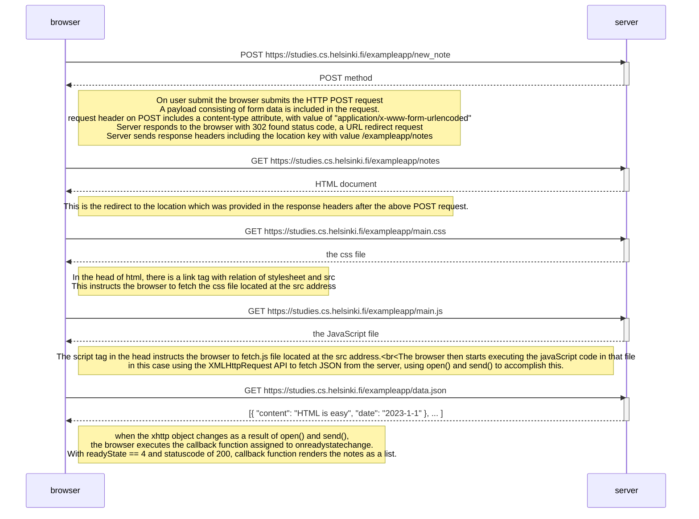

```mermaid
sequenceDiagram
    participant browser
    participant server

    browser->>server: POST https://studies.cs.helsinki.fi/exampleapp/new_note
    activate server
    server-->>browser: POST method
    deactivate server

    Note right of browser: On user submit the browser submits the HTTP POST request<br>A payload consisting of form data is included in the request.<br> request header on POST includes a content-type attribute, with value of "application/x-www-form-urlencoded"<br>Server responds to the browser with 302 found status code, a URL redirect request<br>Server sends response headers including the location key with value /exampleapp/notes   

    browser->>server: GET https://studies.cs.helsinki.fi/exampleapp/notes
    activate server
    server-->>browser: HTML document
    deactivate server

    Note right of browser: This is the redirect to the location which was provided in the response headers after the above POST request.

    browser->>server: GET https://studies.cs.helsinki.fi/exampleapp/main.css
    activate server
    server-->>browser: the css file
    deactivate server

    Note right of browser:  In the head of html, there is a link tag with relation of stylesheet and src<br>This instructs the browser to fetch the css file located at the src address

    browser->>server: GET https://studies.cs.helsinki.fi/exampleapp/main.js
    activate server
    server-->>browser: the JavaScript file
    deactivate server

    Note right of browser: The script tag in the head  instructs the browser to fetch.js file located at the src address.<br<The browser then starts executing the javaScript code in that file<br>in this case using the XMLHttpRequest API to fetch JSON from the server, using open() and send() to accomplish this.

    browser->>server: GET https://studies.cs.helsinki.fi/exampleapp/data.json
    activate server
    server-->>browser: [{ "content": "HTML is easy", "date": "2023-1-1" }, ... ]
    deactivate server

    Note right of browser: when the xhttp object changes as a result of open() and send(), <br>the browser executes the callback function assigned to onreadystatechange.<br>With readyState == 4 and statuscode of 200, callback function renders the notes as a list.
```